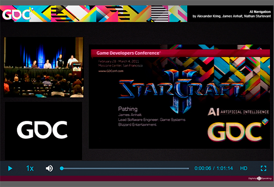
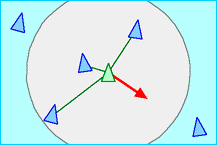
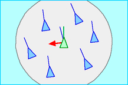
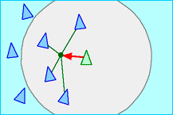
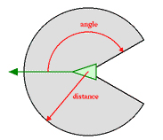
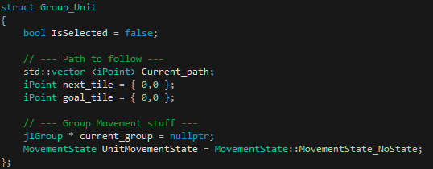
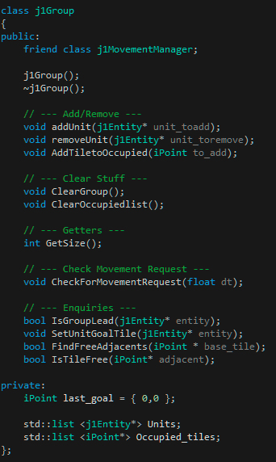
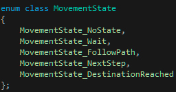

# GroupMovement

I am <https://www.linkedin.com/in/aitor-simona-bouzas-aab43817b/>(Aitor Simona), student of the
<https://www.citm.upc.edu/ing/estudis/graus-videojocs/>(Bachelor’s Degree in Video Games by UPC at CITM). 
This content is generated for the second year’s subject Project 2, under supervision of lecturer
<https://es.linkedin.com/in/ricardpillosu>(Ricard Pillosu).

* My Github Account: [AitorSimona](https://github.com/AitorSimona)

Welcome! I understand you are interested in this topic, one of the cores of the RTS genre!
So what is Group Movement? 

Group Movement: Moving multiple units at the same time through complex terrain, while taking into account the relationships between the units that are part of the group.

Wow, such a generic definition, don't you think? Let us expand it a bit. We are speaking about two big things here...

* Groups
* Movement

## Groups

When we have to deal with more than one unit things get quite complicated, it is no longer a matter of Unit A following the orders we give  it. We are dealing with a group of units, Unit A has to follow the orders received while dealing with those orders its colleagues are receiving, at the same time! 

So, what if we give the order to move from position A to position B to all the units in our group. Will each unit follow its own path towards the destination? But if they do so, they won't be behaving as if they were a group, so we need to keep them together while advancing, right?

Here is where many problems arise. How do we handle this group, how do we keep them together, move them apart each other when colliding, while maintaining a structured formation? My my, what a bunch of questions. There are so many things going on in the interactions between the units and the world and between the units itselves, that we could make a long list of questions of this type. 

So let us keep with the keypoint here: **How do we keep units organised, in a structured way?**

## Movement

Now, if we give the order to move from position A to position B to all the units in our group. We need a way to get a path from A to B, and here we encounter another topic, Pathfinding. Pathfinding is not the main topic of this research, but is is necessary for the sake of it, so we will be using a tile-based greedy algorithm well-known called A*. We will use a very basic implementation of it, but more than enough to enable our units movement. 

So, A* can give us a path, problem solved right? Not at all close. While A* gives us a path from A to B, it takes a good amount of time for it to retrieve this path. This problem is not so big when dealing with a single unit, but remember, we are dealing with groups...

As you may be infering already, we have a big problem, our A* will take too much time to compute a path for every single unit of a large group, so we would need some optimizations to reduce the CPU load our current approach has. We will not go into this optimizations, since it is not the topic we are discussing here, I just want you to be aware of the problem.

Our new keypoint: **How do we move units from one position to another?**

## Movement in Groups

I hope you have a clear idea of our main objectives now, If I were to sum up what I explained in the last two sections ...

Our main keypoint: **How do we move units from one position to another, while keeping them organised, in a structured way?**

***

## Many Games Approach to Group Movement

As always, it is not easy to find this kind of information, technical aspects of games, revenue... I was able to find a decent piece of info looking into the GDC vault, specifically into 2011 conferences. Does it ring a bell, 2011? A famous RTS launched very close to that date...

### Starcraft II

Bingo! Blizzard's Starcraft 2 launched the 27th of July 2010, and in the next GDC James Anhalt (Lead Software Engineer at Blizzard) shed some light on Starcraft 2's tech. He goes into group movement stuff, such as Steering behaviours which I will mention later. 
The other games present in this conference were Heroes on the Move from nStigate Games and Dragon Age Origins from Bioware. They all went deep into pathfinding too, apart from our main topic. It is not strange, since dealing with pathfinding is one of the biggest headaches of the RTS genre.
 
 

[GDC_2011_AiNavigation](https://www.gdcvault.com/play/1014514/AI-Navigation-It-s-Not)

_Click on the link above to see the full GDC 2011 talk_ 

<iframe width="560" height="315" src="https://www.youtube.com/embed/F6h0-uW4JZI" frameborder="0" allow="accelerometer; autoplay; encrypted-media; gyroscope; picture-in-picture" allowfullscreen></iframe>

_Starcraft's 2 Crowd Movement_

### Supreme Commander II

Quite a big name too. In this case Supreme Commander departs from antoher way to approach crowd behaviours, pathfinding. They use a modern way of pathfinding called "Flow Field", also known as Vector Field or Force Field to others. I won't go into detail since it is related to pathfinding but in SC2 they base their group movement on this technique.

Take a look at the following video to see a more accurate view of SC2 Flowfield and crowd movement, narrated by Chris Taylor from Gas Powered Games.

<iframe width="560" height="315" src="https://www.youtube.com/embed/iHuFCnYnP9A" frameborder="0" allow="accelerometer; autoplay; encrypted-media; gyroscope; picture-in-picture" allowfullscreen></iframe>

_Supreme Commander 2's Flowfield showdown_

### Others

I have read that Planetary Annhilation also uses SC2 Flowfield tech, while other old games like Age of Empires seem to use a modification of A*, sadly couldn't find anything on games like the Total War series or the Wargame Series which I like a lot, but as I said information like this is rarely shared in the industry.

***

## How do we approach Group Movement?

Now that the topic has already been slightly introduced, let's look more deeply into the matter beign discussed.

In Crowd-based simulations we can differentiate 3 approaches:

* Flow-based: The crowd as a whole rather than its components. Individuals are equal and behavioural factors are heavily reduced
* Entity-based: All movements are determined by some global laws enforced to the individuals of the group
* Agent-based: Autonomous intelligent individuals. Action-reaction is local to each individual based on a set of rules.

Behavioural factors, rules, laws... Very similar wording, right? Indeed, they all refer to the same concept, called Steering behaviours.

In 1986 Craig Reynolds, a software engineer, expert in artificial life and computer graphics, made a computer model that simulated coordinated animal motion, such as the movement of bird flocks and fish schools. In his words:

"I called the generic simulated flocking creatures boids. The basic flocking model consists of three simple steering behaviors which describe how an individual boid maneuvers based on the positions and velocities of its nearby flockmates".

Boids three Steering behaviours as defined by Craig Reynolds himself, which together are defined as **flocking (swarm)**:

Separation: steer to avoid crowding local flockmates.

 

Alignment: steer towards the average heading of local flockmates.

 

Cohesion: steer to move toward the average position of local flockmates.

 

The boids also have a region on which they have influence over neighboring boids, this region is defined by an angle and distance, building a spherical field around each boid.

 

_All images above are property of Craig Reynolds, his web's link is at the bottom of this webpage_

So we could define this steering behaviours as **a set of rules that regulate the relationship between individuals of a group**.
By Craig Reynolds himself: _"the ability to navigate around their world in a life-like and improvisational manner."_

### Steering Behaviours

So, how many rules can we set to keep our units moving in a structured way? As defined by Craig Reynolds...

* Simple behaviors for individuals and pairs:

  * Seek and Flee
  * Pursue and Evade
  * Wander
  * Arrival
  * Obstacle Avoidance
  * Containment
  * Wall Following
  * Path Following
  * Flow Field Following
  
* Combined behaviors and groups:

  * Crowd Path Following
  * Leader Following
  * Unaligned Collision Avoidance
  * Queuing (at a doorway)
  * Flocking (combining: separation, alignment, cohesion)
  
Wow, right? He defined lots of rules to enforce behaviours into groups, he himself as a precursor to everything videogames have been implementing ever since. 

I'm not going to go one by one explaining each single behaviour since I haven't programmed them and we would extend this way too much, but if you are interested you can use this link: [Steering Behaviours](https://gamedevelopment.tutsplus.com/tutorials/understanding-steering-behaviors-leader-following--gamedev-10810) to gain a better understanding of some of them. Fernando Bevilacqua has some very good visuals to support the explanation.
  
### Pathfinding 

#### A* implementations

Many games use as a baseline for pathfinding implementations of the well-known A* tile-based algorithm (old Age of Empires, Starcraft). These games did not have to deal with as many individuals as later sequels and new ips, so it was not much of a problem.  

#### Flow Field

A modern way of doing pathfinding when managing large groups of individuals, a Flow Field/Vector Field consists of a set of directional vectors that are directed towards the destination while avoiding static obstacles. These vectors are set each in a node of the navigation graph, and are used by individuals to steer towards the goal. Flow fields are very useful with large groups in small maps, but they suffer on big maps if not optimized. An idea would be to issue a flow field request only for those nodes in your graph that are on the way to the destination, or use a local flow field for each individual and then merge it into a group flow field (Supreme Commander 2). I am no expert in the matter, so I won't go deeply into it. In the following video you can see the basic functioning of a Flow Field. 

<iframe width="560" height="315" src="https://www.youtube.com/embed/Bspb9g9nTto" frameborder="0" allow="accelerometer; autoplay; encrypted-media; gyroscope; picture-in-picture" allowfullscreen></iframe>

#### Navigation Mesh

Pathfinding algorithms/solutions work with graphs, wo if you have a graph of an immense number of small tiles and you issue an A* path you will have some serious performance problems. A key to most pathfinding implementations is to use a customized Navigation Mesh, which means a custom graph. 

Instead of having the regular tiles defined by the map, you can divide the map in zones, polygons, bigger tiles, so when issuing an A* request the algorithm only navigates a few tiles instead of thousands, significantly improving performance. SC2 uses a nav mesh, and has a hierarchical division of the graph, runs A* through the highest level (less nodes), traveling through tile "portals" and then issues a flow field request for the ones needed. I will leave a link to the method in the bottom of this webpage, check it if you are interested.

***

## My Take

Well, here we are! I hope you are still around, now that the topic has been properly introduced (I hope) let's head to a very simple implementation of Group Movement. Our goal is simple, handling the creation of groups, based on some entities/individuals and have them move from A to B. This implementation lets units overlap on the way to the destination, but organizes them at the end, so each entity/individual is on a different tile than the others, keeping a simple formation. 

We could fit this implementation in the **Flow-based approach** since we care about the group and not about every single individual. 

To do so we will need 4 utilities:

* Pathfinding Module
* Group Class & Unit Structure
* Movement Manager Module

The first one, the pathfinding module, is already implemented to serve the purpose of this research, it consists of a very basic implementation of A* that will allow us to issue a path request from A to B.

### Group Class & Unit Structure

In order to manage entities we will create a class and a struct.

The Unit Structure: It contains information about the path to follow, the unit's state, a pointer to the group on which the unit is currently assigned and a boolean to know if the unit is selected

 

_The Unit Structure_

The Group Class: It contains a list of the individuals/units that are in the group, methods to control the list, adding/removal/clear and more methods dedicated to units movement.

 

_The Group Class_

### The Movement Manager

Whenever an individual is ordered to move, a state-machine will tke control of the individual's movement. It has 5 states, which are the following:

1. MovementState_NoState: The Unit is static, if a move order is issued, goals for the group are set and state changes to NextStep.
2.	MovementState_Wait: The Unit is put into Wait state if any obstacle is found, and should deal with the obstacle (do we repath?).
3.	MovementState_FollowPath: The Unit has a next node assigned, so it moves to reach this node, when reached change state to NextStep.
4. MovementState_NextStep: We get the next node in the path, change state to FollowPath. If there is no next node, change state to DestinationReached.
5. MovementState_DestinationReached: The Unit has arrived to the destination, change state to NoState.

 

_The Unit's Movement States_

**PROBLEM**

When a move order is issued, every unit in the group calculates a path to the destination, but this means that all units will end up in the same node, overlapping. Why don't we make units move apart from each other when reaching the destination? If we did this, all units will follow the same path, ending up in a line, which is not natural group movement at all, so how do we solve this?

**IMPLEMENTATION OF A SOLUTION**

We want to have units structured and apart in the end goal, but letting them overlap on the way there, besides we don't want all units to follow the same path, since they end up shaping a line. 

Now what if we give each unit a path to a different destination? This would make units take a different path from their colleagues, and would end up having them apart from each other at the destination. It does look like a plan, doesn't it?

**STEP 1**

We need to assign each unit a different destination and make them create a path to it, but how do we assign these destinations?
To keep the units together, these destinations should be adjacent to the move order main destination, right? Now we can easily get the adjacent nodes and assign them to the units, but what if we have more units than adjacent nodes? There are no free adjacents!

In this case we know that the first 9 units (Adjacents for cardinal directions N, S, W, E, NE, NW, SE, SW) will already have a destination, different from one another, so what we will do is get the second unit's destination and find adjacents to it, successfully solving the problem. 

Each time we check an adjacent destination, we are making sure it is a walkable node and that no other unit of the group has this node assigned as destination. This is done with a list, every time a unit is assigned a new destination, this node is added to the list. This list is called Occupied_tiles and has all the nodes that are no longer available to get as new destination for the other units. 

**STEP 2**

So now we have a different destination for each unit, and we issue a path for each one, getting them organisez in a simple formation at the desired position. Simple, right?

*** 

## Performance && Improvements

Computing a path for a single unit is not expensive for our CPU, but dealing with a lot of path requests gets things complicated very soon, even if we have a modern CPU. We need our movement to feel natural while being as less expensive as possible. The approach implemented is expensive when a decent number of units are involved, but does not have units in a line and looks more natural. 

I have used Brofiler to measure the impact on performance of multiple units movement, bear in mind that these results take into account the sample map I use in this implementation, and would change with maps of different sizes and bigger/smaller paths. All data gathered was taking into account a path from one side to the other side of the sample map.

**Brofiler Data**
* Group of 8 Units: Peaks of 50 ms.
* Group of 16 Units: Peaks of 90 ms.
* Group of 24 Units: Peaks of 130 ms.

With groups of 24 units you can notice a slight interruption, caused by the repetition of a single frame. Since we are spending too much time trying to finish the current frame, we are rendering the same frame multiple times. This delay is more noticeable as time spent on the current frame increases. 

The problem here is the Pathfinding module, our A* is too basic and is taking too much time to compute 24 paths. We could create 1 path per frame, but what would happen if we have lots of units? We would notice that some units are static while others start getting their paths done, a kind of wave reaction. 

So seeing this performance problems we need to tip the balance in one direction, performance versus quality of movement right? Well, I would not sacrifice any of them, of course, so the solution is to improve on two directions.

**A Modern Pathfinding**

Our A* is very basic, and has a high impact on performance. I have introduced Flow Fields as a modern pathfinding tech for large groups of units, used in SC2 for example. So we need to implement a solution in this direction. Making our pathfinding efficient is key in order to have groups in movement, our A* is acting as a bottleneck now.

**A Set of Steering behaviours**

In this implementation, no steering behaviours have been used, so our movement could be heavily improved when implementing some of them, both in terms of life-like feeling and performance. 

What if the way we move our groups enables us to only make a single path request? And on the contrary, what if our pathfinding tech enables us to move any number of units with the behaviours we want? As you can see, we can improve on A to improve B, and the other way too.

*** 

## Considerations && Final Words

Well, it seems we made it! We have implemented a very simple and generic solution to get ourselves in the field of group movement. 
This is a departing point, there are lots and lots of stuff to look into from this point, what about steering behaviours, collision avoidance, formations... 

Many questions can be made:

What if a unit with a pre-calculated path finds a newly added collider, a building for example? Repathing is expensive, performance-wise, and if lots of units find themselves in this situation things will get complicated soon enough. 

What if a group runs into another group, and we don't want them to overlap? How do they follow their path,, while avoiding other units that get in their way, like in modern RTS games?

What if I want to make an RTS with lots of units? You should be looking into Flow Fields, nav meshes and optimizations

What if I want to have formations, like the Total War Series? And like in Total War, what if I want to see the destinations of every unit when dragging the mouse, while being able to modify the formation?

Such a big amount of questions! It does really get me excited to know how many things take part into crowd behaviours, there are tons of stuff to learn about! See you around and thanks for reading!

***

## References

Huge thanks to everyone I took information from, for posting it on the internet.

* **Special Mention**
  * [Craig Reynolds](http://www.red3d.com/index.html)
* **About Pathfinding**  
  * [Starcraft2 PF tech - GameDev](https://www.gamedev.net/forums/topic/563819-whats-starcraft2s-pathfinding-tech/)
  * [Pathfinding and other stuff - Amit Patel](https://www.redblobgames.com/pathfinding/a-star/introduction.html)
* **About Movement**
  * [Coordinated Unit Movement - Dave Pottinger](http://www.gamasutra.com/view/feature/131720/coordinated_unit_movement.php)
  * [Implementing Coordinated Movement - Dave Pottinger](http://www.gamasutra.com/view/feature/131721/implementing_coordinated_movement.php)
  * [Coordinated Unit Movement - Jeremiah Warm](http://www.jeremiahwarm.com/coordinated-movement.php)
  * [RTS Group Movement- Sandra Alvarez](https://sandruski.github.io/RTS-Group-Movement/)
* **About Crowds**  
  * [Crowd Flows](http://grail.cs.washington.edu/projects/crowd-flows/)
  * [Multi-Unit movement - Reddit](https://www.reddit.com/r/Unity3D/comments/7v62t2/how_do_rts_games_such_as_starcraft_2_or_warcraft/)
  * [Crowd Simulation - Wikipedia](https://en.wikipedia.org/wiki/Crowd_simulation)
* **About Flow Fields**
  * [Game Ai Pro - Elijah Emerson](http://www.gameaipro.com/GameAIPro/GameAIPro_Chapter23_Crowd_Pathfinding_and_Steering_Using_Flow_Field_Tiles.pdf)
  * [Flow Field Pathfinding - Leif Node](https://leifnode.com/2013/12/flow-field-pathfinding/)
* **About Pathfinding && Movement**
  * [Gamasutra - Andrew Erridge](http://www.gamasutra.com/blogs/AndrewErridge/20180522/318413/Group_Pathfinding__Movement_in_RTS_Style_Games.php)
* **About Pathfinding, Steering and Movement**
  * [Github - @daveleaver](https://howtorts.github.io/)
  * [Steering Behaviours - Fernando Bevilacqua](https://gamedevelopment.tutsplus.com/series/understanding-steering-behaviors--gamedev-12732)
  * [GDC Vault 2011 - AI Navigation](https://www.gdcvault.com/play/1014514/AI-Navigation-It-s-Not)

***

## Practice with TODOs!

Up for some practice? I'll propose a series of little exercises to get you to better understand the code I've implemented, don't panic, they are very simple and only aim to get you in touch with the code faster.

Check the GitHub repository, there is a folder for the Handout, that contains the TODOs, remember that the base folder of the project is Game, so change it in Project Properties -> Configuration Properties -> Debugging -> Working Directory.

You should be able to spawn entities with the mouse's middle button, and also creating a rectangle clicking and dragging the mouse. These rectangle selects all units that are inside its bounds.

Use Ctrl+Shift+F and type TODO to check for all the TODOs in code, head to TODO 1.

* **TODO 1**

          * TODO 1: If we find an entity then the group is valid and can be created.
	  * TODO 1: Remove the entity from a previous group if any is found.
	  * TODO 1: Add the entity to the new group, update its current group pointer.
 
 * **Solution**
We set the Validgroup Boolean to true, check if the unit's current group is nullptr and if is, we remove the entity from this last group and add it to the new one. 

IMG

Expected Behaviour: You should be able to group units now, and when issuing a move order, these units should travel very fast to the destination, most of them overlapping on one position.

* **TODO 2**

	  * TODO 2: Check if any adjacent tile to the base_tile is free of entities.
	  * TODO 2: Add a call to IsTileFree on each case.
	  * TODO 2: Search for the adjacent given in the occupied_tiles list.
	  * TODO 2: If the adjacent is found, return false.
	  * TODO 2: If the adjacent is not found, add it to the occupied_tiles list.

 * **Solution**
We add a call to IsTileFree to each if statement, and inside this function, we iterate the Occupied_tiles list, compare the given adjacent with each tile in the list and if we find it this means another unit already chose this adjacent as destination tile, so we return false and check the next adjacent. If we do not find it in the list this means it is free and we can choose it as our destination. 

IMG

Expected Behaviour: You should see how units end up on different destinations at the end of the paths, keeping close to their partners without overlapping.

* **TODO 3**

	  * TODO 3: Compute the module of our vector.
	  * TODO 3: We want a unitary vector to update the unit's direction/position.
	  * TODO 3: Now we Apply the unit's Speed and the dt to the unitary vector. 

 * **Solution**
Having the distance to the next tile, which is a vector's 2D components pointing to it, we can compute the module of this vector and divide each component by the computed module to get the unitary components of the vector. Now we use this vector and multiply it by dt and the unit's speed to get the distance and direction we need to consider on this iteration. Just some simple maths.

IMG

Expected behaviour: Units move at a constant speed, no weird behaviours. 

Congratulations! You have successfully reached the solution!

## Homework && more Improvements!

If you want to move on from this point, I'll give you some ideas of interesting stuff to implement on the current code.

* Implement a local avoidance system: Our units are overlaping on the way to the destination, what if we define a vital space for each one, a collider, and use attraction/repulsion forces to pull units together and push them apart?
* Implement any set of steering behaviours: Let your imagination decide, there is plenty to try out, start checking one by one how they work and then try to combine them!
* If we build something on a unit's path, a collider, the unit should avoid it right? On the current implementation I have not taken this into account, so units will get stucked, try to avoid repathing and search for a more optimal solution.
* Try making two groups of units, with collision avoidance implemented, and have one go across another, you should find a way to go across the other group, what if you ask the other units to move apart? 
* Think about how Total War games use formations, they have a preview of how the units will end up at the destination, and you can tune it the way you like, play with formations!
* Our A* is very slow when moving large groups of units, look for Flow field implementations and implement one yourself! You could also dive into navigation meshes!
